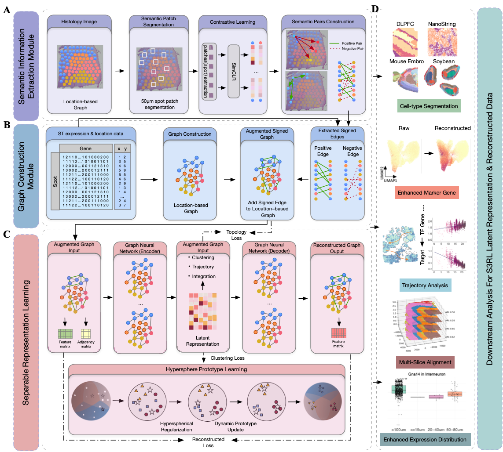

.. S3RL documentation master file, created by
   sphinx-quickstart on Wed Apr 16 19:43:51 2025.
   You can adapt this file completely to your liking, but it should at least
   contain the root `toctree` directive.

S3RL – Separable Spatial Single-cell Transcriptome Representation Learning for Enhanced Reconstruction of Spatial Transcriptomic Landscapes
=============================================================================

.. toctree::
   :maxdepth: 1

   Installation_PyG
   Tutorial-DLPFC
   Tutorial-Nanostring
   Tutorial-Mouse_Brain_Anterior
   Tutorial-Human_Breast_Cancer
   T6_L-R_pairs

News
========
2025.04.10 S3RL is now available on GitHub at https://github.com/AI4Bread/S3RL.  
S3RL is implemented based on PyTorch Geometric (pyG) and supports efficient training and flexible batch processing for large-scale spatial transcriptomics datasets.  

The model provides enhanced spatial representation learning through the use of a Graph Transformer architecture and hyperspherical prototype clustering for clear domain separation.  
Please refer to Tutorials 1-5 for training strategies and batch processing guidance.

Introduction
========
Spatial transcriptomics enables in situ mapping of gene expression, offering insights into tissue organization and cell–cell interactions. However, its utility is limited by data sparsity and technical noise for decoding complex tissue microenvironments. Here, we introduce S3RL, a representation learning framework designed to enhance the fidelity of spatial transcriptomic data. By effectively denoising sparse measurements and amplifying biologically relevant signals, S3RL enables the recovery of fine-grained spatial expression patterns and regulatory relationships that are otherwise lost. Applied across diverse human, mouse and plant tissues, S3RL not only improves spatial domain identification and multi-slice alignment (up to 120\% ARI improvement) but also uncovers previously unrecognized ligand–receptor signaling and spatial gene expression gradients critical for understanding immune-tumor crosstalk and plant developmental trajectories. These results establish S3RL as a powerful tool for extracting latent biological programs from noisy spatial transcriptomic datasets, paving the way for deeper exploration of tissue biology and disease mechanisms.

Citation
========
Fu, Laiyi†, Penglei Wang†, Gaoyuan Xu†, Jitao Lu, Hequan Sun, and Danyang Wu*.  
*S3RL: Separable Spatial Single-cell Transcriptome Representation Learning for Enhanced Reconstruction of Spatial Transcriptomic Landscapes.* *in review*, 2025.
